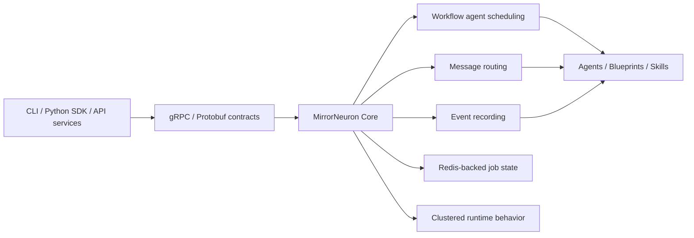

<h1 align="center">MirrorNeuron Core 🧠</h1>

<p align="center">
  <strong>Durable agent runtime for self-organizing workflow software.</strong>
</p>

<p align="center">
  <a href="https://github.com/MirrorNeuronLab/mn-docs"></a>
  
  
  
  
</p>

MirrorNeuron Core is the Elixir/OTP runtime at the center of the MirrorNeuron
project: a durable, message-driven foundation for AI workflows that need to keep
running, recover cleanly, and coordinate work across agents and services.

The project is built around a simple direction: software is moving from
hardcoded workflows and static UIs toward reusable intelligence. Agents should be
able to assemble the workflow logic and task-specific interface they need at
runtime, while the infrastructure underneath stays deterministic, observable, and
reliable.

Core is that infrastructure layer. It schedules workflow agents, routes messages,
records events, persists job state through Redis, manages clustered runtime
behavior, and exposes gRPC services for the broader MirrorNeuron ecosystem.

> **Alpha notice:** MirrorNeuron is in alpha. APIs, manifests, release artifacts,
> and ecosystem components may change between releases.

---

## Why MirrorNeuron Core exists

Most agent prototypes begin as a prompt, a script, or a tightly coupled workflow
UI. The same pressure shows up in desktop and workflow software: users want
interfaces and processes that can reorganize around the task instead of forcing
every task through a pre-baked path. That works until the work becomes long-running, multi-step, interruptible, or
shared across services. At that point, the agent needs more than model calls: it
needs runtime guarantees.

MirrorNeuron Core focuses on the deterministic side of agentic software:

<table>
<tr>
<td><b>Durable workflow execution</b></td>
<td>Keep agent work moving through a runtime designed for long-running workflows, clean recovery, and persisted job state.</td>
</tr>
<tr>
<td><b>Message-driven coordination</b></td>
<td>Route work across agents and services through explicit runtime messaging instead of hidden in-process coupling.</td>
</tr>
<tr>
<td><b>Event recording</b></td>
<td>Record workflow events so the system can reason about what happened, recover from failures, and expose runtime behavior to surrounding services.</td>
</tr>
<tr>
<td><b>Redis-backed state</b></td>
<td>Persist job state outside the process for workflows that should survive ordinary runtime boundaries.</td>
</tr>
<tr>
<td><b>gRPC service boundary</b></td>
<td>Expose protobuf-backed services so CLIs, SDKs, API services, agents, blueprints, and skills can integrate with the same runtime core.</td>
</tr>
<tr>
<td><b>OTP foundation</b></td>
<td>Use Elixir/OTP as the runtime substrate for supervised, message-oriented systems that are expected to stay alive.</td>
</tr>
</table>

---

## The idea: generated software, deterministic runtime

MirrorNeuron is designed for a different shape of application: one where the
agent can create or adapt the logic it needs while the runtime remains explicit
and dependable.

```text
Traditional app
  fixed UI + fixed workflow + hidden state

Agent-native app
  generated task interface + generated workflow logic + deterministic runtime
```

For developers, this means MirrorNeuron Core is not trying to be a monolithic
agent app. It is the lower-level runtime that other pieces build on: scheduling,
coordination, events, persistence, clustering behavior, and service contracts.

The goal is to make agent workflows feel flexible at the edge while keeping the
center of the system boring in the best possible way: stateful, testable,
recoverable, and explicit.

---

## Architecture at a glance



Core sits between higher-level developer surfaces and the operational substrate
that keeps workflow execution reliable. Higher-level components can change how
agents are authored, invoked, or presented to users without requiring each one to
rebuild the runtime primitives from scratch.

---

## When to use this repository

Use MirrorNeuron Core when you are building or extending systems that need:

- AI workflows that continue across multiple steps instead of completing in one
  request-response turn.
- Agent coordination through messages and explicit runtime services.
- Redis-backed job state for durable execution.
- Event recording around workflow execution.
- A gRPC/protobuf boundary for integrating runtimes, SDKs, API services, agents,
  blueprints, or skills.
- A runtime layer that can support clustered behavior rather than only local
  single-process orchestration.

If you are evaluating the whole MirrorNeuron project, start with the
[MirrorNeuron documentation repo](https://github.com/MirrorNeuronLab/mn-docs).
It explains the overall architecture, component responsibilities, runtime model,
deployment expectations, and how Core fits with the rest of the stack.

---

## Quick start

Install dependencies and run the core test suite:

```bash
mix deps.get
mix test
```

For Redis-backed runtime tests, start Redis first:

```bash
docker run -d --name mirror-neuron-redis -p 6379:6379 redis:7
mix test
```

Clean up the local Redis container when you are done:

```bash
docker rm -f mirror-neuron-redis
```

---

## Repository map

| Path | Purpose |
| --- | --- |
| `lib/mirror_neuron/` | Core runtime modules. |
| `lib/mirror_neuron_grpc/` | gRPC service implementation. |
| `proto/` | Protobuf contracts. |
| `config/` | Runtime configuration. |
| `tests/` | Unit, regression, API, and e2e tests. |

---

## Runtime responsibilities

MirrorNeuron Core is intentionally narrow. Its job is to provide the dependable
runtime primitives that agent-facing tools can share.

| Responsibility | What it means in this repo |
| --- | --- |
| Workflow agent scheduling | Core coordinates workflow agents as runtime-managed work. |
| Message routing | Services and agents communicate through explicit message paths. |
| Event recording | Runtime events are captured as part of workflow execution. |
| Job state persistence | Redis is used for persisted job state in runtime-backed flows. |
| Cluster behavior | Core manages clustered runtime behavior for the MirrorNeuron system. |
| gRPC services | External components integrate through protobuf-backed service contracts. |

---

## Developer workflow

A typical local development loop is intentionally small:

```bash
mix deps.get
mix test
```

When touching Redis-backed behavior, run the Redis-backed test path as well:

```bash
docker run -d --name mirror-neuron-redis -p 6379:6379 redis:7
mix test
docker rm -f mirror-neuron-redis
```

When changing service boundaries, check the protobuf contracts in `proto/` and
the gRPC implementation under `lib/mirror_neuron_grpc/` together. Runtime changes
should generally be accompanied by tests under `tests/`, especially for
scheduling, routing, persistence, API behavior, and regression coverage.

---

## Documentation

| Resource | What to read it for |
| --- | --- |
| [MirrorNeuron documentation](https://github.com/MirrorNeuronLab/mn-docs) | Project-level architecture, component responsibilities, runtime model, and deployment expectations. |
| [Component guide](https://github.com/MirrorNeuronLab/mn-docs/blob/HEAD/component-guide.md#mirrorneuron-core) | How MirrorNeuron Core fits into the broader MirrorNeuron stack. |
| [Runtime architecture](https://github.com/MirrorNeuronLab/mn-docs/blob/HEAD/runtime-architecture.md) | The runtime model and execution architecture. |
| [Cluster architecture](https://github.com/MirrorNeuronLab/mn-docs/blob/HEAD/cluster_architecture.md) | Clustered runtime behavior and deployment shape. |
| [Reliability guide](https://github.com/MirrorNeuronLab/mn-docs/blob/HEAD/reliability.md) | Reliability expectations and operational model. |
| [Security model](https://github.com/MirrorNeuronLab/mn-docs/blob/HEAD/security.md) | Security assumptions and boundaries. |

---

## Project status

MirrorNeuron Core is public alpha software. Expect changes in APIs, manifests,
release artifacts, and ecosystem integration points as the runtime evolves.

For now, the best way to understand the project is to read this repository next
to the documentation repo, run the tests, and inspect the protobuf and runtime
modules that define the current service boundary.
